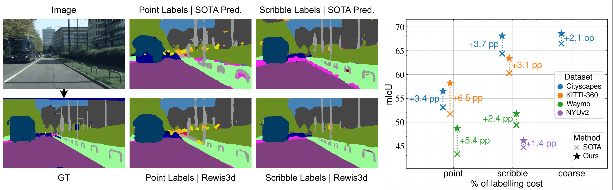

# Rewis3d

**Re**construction for **W**eakly-Supervised Semantic **S**egmentation in **3D**

A complete pipeline for training 3D semantic segmentation models using weak supervision (scribble annotations) through joint 2D-3D learning. The project reconstructs 3D point clouds from multi-view images and trains segmentation models that leverage cross-modal consistency between 2D images and 3D point clouds.

<p align="center">
  
</p>

## Key Features

- 🔄 **End-to-end pipeline**: From raw images to trained segmentation models
- 🏗️ **Modular reconstruction**: Pluggable 3D reconstruction methods (MapAnything, Depth Anything V3)
- 🎯 **Weak supervision**: Train with weak annotations instead of dense labels
- 🔗 **Cross-modal learning**: Joint 2D-3D training with consistency constraints
- 📊 **Multiple datasets**: Support for KITTI-360, Waymo, Cityscapes, NYUv2
- ⚡ **Scalable**: Multi-GPU support for both reconstruction and training

## Pipeline Overview

```
┌─────────────────────────────────────────────────────────────────────────┐
│                           Rewis3d Pipeline                              │
├─────────────────────────────────────────────────────────────────────────┤
│                                                                         │
│  ┌──────────────┐    ┌─────────────────────┐    ┌──────────────────┐    │
│  │   Raw Data   │──▶│  Rewis3d_Reconstr.  │──▶│  Rewis3d_Model   │    │
│  │              │    │                     │    │                  │    │
│  │ • Images     │    │ • 3D Reconstruction │    │ • 2D Segmentor   │    │
│  │ • Scribbles  │    │ • Label Projection  │    │ • 3D Segmentor   │    │
│  │ • (Poses)    │    │ • Point Sampling    │    │ • CMC Loss       │    │
│  └──────────────┘    └─────────────────────┘    └──────────────────┘    │
│                              │                          │               │
│                              ▼                          ▼               │
│                        .npz files                Trained Models         │
│                       (point clouds +           (2D & 3D weights)       │
│                        2D/3D labels)                                    │
└─────────────────────────────────────────────────────────────────────────┘
```

## Repository Structure

```
Rewis3d/
├── Rewis3d_Reconstruction/    # 3D reconstruction & dataset generation
│   ├── reconstruction/        # Core reconstruction pipeline
│   │   ├── methods/           # Pluggable reconstruction methods
│   │   └── config/            # Dataset configurations
│   ├── visualizations/        # Visualization tools
│   └── pyproject.toml         # UV dependencies
│
├── Rewis3d_Model/             # Segmentation model training
│   ├── pointcept/             # Training framework (based on Pointcept)
│   │   ├── models/            # 2D & 3D model architectures
│   │   ├── datasets/          # Data loading & transforms
│   │   └── engines/           # Training & evaluation
│   ├── configs/               # Training configurations
│   ├── scripts/               # Train/test scripts
│   └── environment.yml        # Conda dependencies
│
└── README.md                  # This file
```

## Quick Start

### 1. Clone the Repository

```bash
git clone https://github.com/jojays/Rewis3d.git
cd Rewis3d
```

### 2. Generate Reconstruction Dataset

```bash
cd Rewis3d_Reconstruction

# Install dependencies with UV
curl -LsSf https://astral.sh/uv/install.sh | sh
uv sync

# Run reconstruction
uv run -m reconstruction.generate_dataset --config reconstruction/config/kitti360.yaml
```

See [Rewis3d_Reconstruction/Readme.md](Rewis3d_Reconstruction/Readme.md) for detailed instructions.

### 3. Train Segmentation Model

```bash
cd Rewis3d_Model

# Create conda environment
micromamba create -f environment.yml
micromamba activate pointcept-torch2.5.0-cu12.4

# Start training
sh scripts/train.sh -d kitti360 -c ptv3_map_anything -n my_experiment -g 4
```

See [Rewis3d_Model/README.md](Rewis3d_Model/README.md) for detailed instructions.

## Module Documentation

| Module | Description | Documentation |
|--------|-------------|---------------|
| **Rewis3d_Reconstruction** | 3D reconstruction from images, label projection, dataset generation | [README](Rewis3d_Reconstruction/Readme.md) |
| **Rewis3d_Model** | Joint 2D-3D segmentation training with PT-v3 and SegFormer | [README](Rewis3d_Model/README.md) |

## Supported Datasets

| Dataset | Domain | Reconstruction | Training |
|---------|--------|----------------|----------|
| KITTI-360 | Outdoor driving | ✅ | ✅ |
| Waymo Open | Outdoor driving | ✅ | ✅ |
| Cityscapes | Urban streets | ✅ | ✅ |
| NYUv2 | Indoor scenes | ✅ | ✅ |

## Reconstruction Methods

| Method | Description |
|--------|-------------|
| **MapAnything** | Meta's dense multi-view reconstruction model |
| **Depth Anything V3** | Metric depth estimation with sky segmentation |

## Model Architecture

### 3D Branch
- **Backbone**: Point Transformer V3 (PT-v3)
- **Input**: XYZ coordinates + RGB colors
- **Output**: Per-point semantic logits

### 2D Branch
- **Backbone**: SegFormer MiT-B4
- **Input**: RGB images
- **Output**: Per-pixel semantic logits

### Cross-Modal Consistency
The model uses a student-teacher framework with cross-modal consistency (CMC) loss that enforces agreement between 2D and 3D predictions through differentiable projection.

<p align="center">
  
</p>

## Requirements

### Rewis3d_Reconstruction
- Python ≥ 3.11
- CUDA-compatible GPU
- [UV](https://github.com/astral-sh/uv) package manager

### Rewis3d_Model
- Python 3.10
- CUDA 12.4
- Micromamba/Conda
- 24GB+ GPU memory recommended

## Citation

If you find this work useful, please cite:
#TODO Add
```bibtex
@article{rewis3d2024,
  title={Rewis3d: Reconstruction for Weakly-Supervised Semantic Segmentation},
  author={...},
  journal={...},
  year={2024}
}
```

## Acknowledgments

This project builds upon several excellent open-source projects:

- [Pointcept](https://github.com/Pointcept/Pointcept) - Point cloud perception framework
- [Point Transformer V3](https://github.com/Pointcept/PointTransformerV3) - 3D backbone
- [SegFormer](https://github.com/NVlabs/SegFormer) - 2D backbone
- [MapAnything](https://github.com/facebookresearch/MapAnything) - Multi-view reconstruction
- [Depth Anything V3](https://github.com/DepthAnything/Depth-Anything-V3) - Monocular depth estimation

## License

See [LICENSE](LICENSE) for details.
