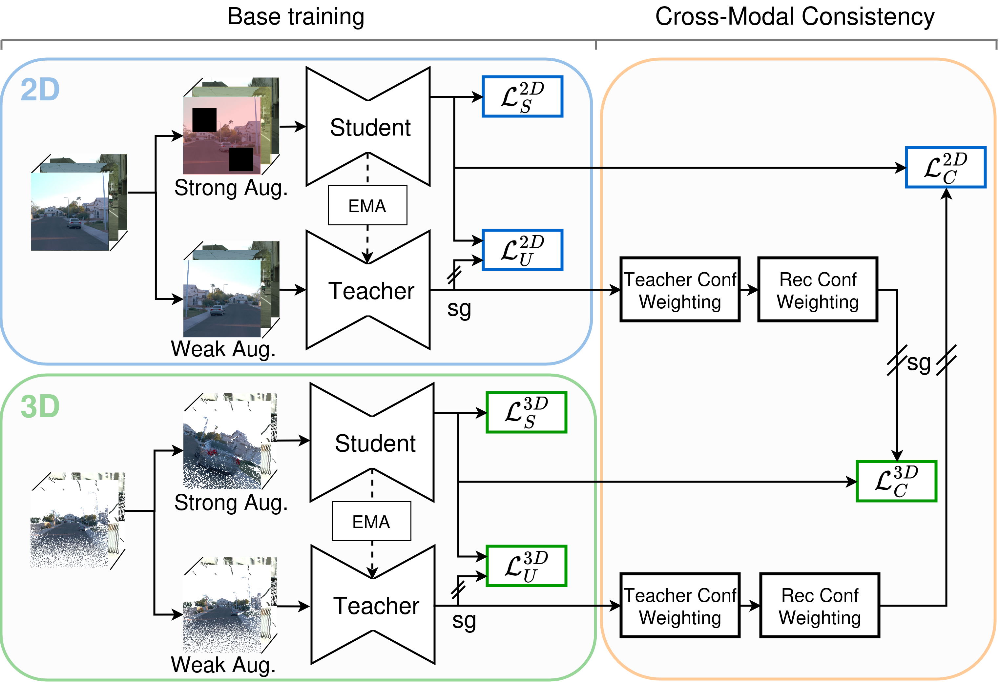

# Rewis3d Model
A 3D point cloud semantic segmentation model with joint 2D-3D learning using Point Transformer V3. This module trains on reconstructed point cloud datasets and learns to segment both 2D images and 3D point clouds with cross-modal consistency.

<p align="center">
  
</p>


> **Note:** This codebase is built on top of [Pointcept](https://github.com/Pointcept/Pointcept), a powerful and flexible codebase for point cloud perception research.

## Overview

The model pipeline:
1. **Loads reconstructed data** from `.npz` files (produced by Rewis3d_Reconstruction)
2. **Trains joint 2D-3D models** with student-teacher architecture
3. **Uses cross-modal consistency loss** (CMC) for weak supervision
4. **Supports scribble-based training** without dense labels

## Key Features

- **Point Transformer V3 (PT-v3)** backbone for 3D segmentation
- **MiT-B4 (SegFormer)** backbone for 2D segmentation
- **Student-Teacher framework** for semi-supervised learning
- **Cross-Modal Consistency Loss** for 2D-3D alignment
- **Sky-aware training** with dedicated sky class handling
- **Distributed training** with multi-GPU support (SLURM compatible)

## Installation

### Prerequisites
- Linux (tested on Ubuntu)
- CUDA 12.4
- Python 3.10
- Micromamba/Conda (recommended for CUDA extensions)

### Environment Setup

For detailed environment setup instructions, please follow the official [Pointcept Installation Guide](https://github.com/Pointcept/Pointcept#installation).

Alternatively, use the provided `environment.yml`:

```bash
cd Rewis3d_Model

# Create environment from environment.yml
micromamba create -f environment.yml
micromamba activate rewis3dModel
bash install_ops.sh


# Build CUDA extensions (pointops, pointgroup_ops)
# These are automatically built via pip install in environment.yml
# If needed manually:
cd libs/pointops && pip install -e . && cd ../..
cd libs/pointgroup_ops && pip install -e . && cd ../..
```

### Environment Details

The environment includes:
- PyTorch 2.5.0 + CUDA 12.4
- Flash Attention for efficient transformers
- torch-scatter, torch-sparse, torch-cluster for graph operations
- spconv-cu124 for sparse convolutions
- Open3D for visualization

## Quick Start

### Training

```bash
# Single GPU training
sh scripts/train.sh -d kitti360 -c ptv3_map_anything -n experiment_name -g 1

# Multi-GPU training (4 GPUs)
sh scripts/train.sh -d kitti360 -c ptv3_map_anything -n experiment_name -g 4

# Resume training from last checkpoint
sh scripts/train.sh -d kitti360 -n experiment_name -g 4 -r true

# Load pretrained weights (fine-tuning, does NOT resume optimizer/scheduler)
sh scripts/train.sh -d kitti360 -c ptv3_map_anything -n experiment_name -w checkpoints/concerto_large_outdoor.pth
```

### Loading Weights vs Resuming Training

There are two different ways to load checkpoints:

| Method | Command | What it loads | Use case |
|--------|---------|---------------|----------|
| **Resume** | `-r true` | Model weights + optimizer + scheduler + epoch | Continue interrupted training |
| **Load weights** | `-w path/to/weights.pth` | Model weights only | Fine-tuning from pretrained |

**Resume (`-r true`):**
- Automatically loads `model_last.pth` from the experiment directory
- Restores optimizer state, scheduler state, AMP scalers, epoch counter
- Uses the saved config from the experiment directory (no need for `-c`)
- Training continues exactly where it left off

**Load weights (`-w`):**
- Only loads model weights (student + teacher for 2D and 3D)
- Starts training from epoch 0 with fresh optimizer/scheduler
- Requires a config file (`-c`)
- Use for fine-tuning or transfer learning

> **Note:** The `resume` and `weight` variables in config files are overridden by the script flags. You don't need to set them in the config - use the command line flags instead.

### Script Options

| Option | Description | Default |
|--------|-------------|---------|
| `-d` | Dataset name | `scannet` |
| `-c` | Config name (without .py) | `None` |
| `-n` | Experiment name | `debug` |
| `-g` | Number of GPUs | auto-detect |
| `-w` | Weight file path | `None` |
| `-r` | Resume training (`true`/`false`) | `false` |
| `-m` | Number of machines | `1` |

## Configuration

Configs are located in `configs/<dataset>/`. Example structure:

```python
# configs/kitti360/ptv3_map_anything.py

_base_ = ["../../_base_/default_runtime.py"]

# Training settings
batch_size = 14
epoch = 35
enable_amp = True  # Mixed precision training

# Cross-modal consistency loss
use_cmc_loss = True
cmc_epoch = 15  # Start CMC after epoch 15
cmc_max_weight_2d = 0.075
cmc_max_weight_3d = 0.125

# 2D Model (SegFormer MiT-B4)
model_2d = dict(
    type="Segmentation2DModel",
    num_classes=16,
    model="nvidia/mit-b4",
    criteria=[dict(type="PartialConsistencyLoss", ...)],
)

# 3D Model (Point Transformer V3)
model_3d = dict(
    type="Segmentation3DModel",
    num_classes=15,  # No sky class in 3D
    backbone=dict(
        type="PT-v3m1",
        in_channels=6,  # XYZ + RGB
        enc_depths=(2, 2, 2, 6, 2),
        enc_channels=(32, 64, 128, 256, 512),
        enable_flash=True,  # Flash attention
    ),
    criteria=[dict(type="PartialConsistencyLoss3D", ...)],
)

# Dataset
data_root = "data/KITTI360_MA"
data = dict(
    num_classes=16,
    ignore_index=255,
    train=dict(
        type="DefaultReconstructedDataset",
        split="training",
        data_root=data_root,
        transform=[...],      # 3D augmentations
        transform_2d=[...],   # 2D augmentations
    ),
    val=dict(...),
)
```

### Available Configs

| Config | Dataset | Description |
|--------|---------|-------------|
| `kitti360/ptv3_map_anything.py` | KITTI-360 | Outdoor driving, MapAnything reconstruction |
| `kitti360/ptv3_map_anything_sky_optimized.py` | KITTI-360 | Sky-optimized training |
| `cityscapes/ptv3_map_anything.py` | Cityscapes | Urban scenes |
| `cityscapes/ptv3_concerto_map_anything.py` | Cityscapes | With Concerto pretrained weights |
| `waymo/*.py` | Waymo Open | Large-scale driving |
| `nyuv2/*.py` | NYUv2 | Indoor scenes |

## Data Format

### Input Data Structure

The model expects data in `data/<dataset_name>/` with the following structure:

```
data/KITTI360_MA/
├── training/
│   ├── scene_001_view_000.npz
│   ├── scene_001_view_001.npz
│   └── ...
└── validation/
    └── ...
```

### NPZ File Contents

Each `.npz` file contains:

```python
data = np.load("sample.npz", allow_pickle=True)
data_3d = dict(data["data_3d"].item())
data_2d = dict(data["data_2d"].item())

# 3D data
data_3d["student_coord"]      # (N, 3) - XYZ coordinates
data_3d["student_colors"]     # (N, 3) - RGB colors
data_3d["student_segment"]    # (N,) - Scribble labels
data_3d["original_segment"]   # (N,) - Full labels
data_3d["conf"]               # (N,) - Confidence scores

# 2D data
data_2d["student_image_1"]    # (H, W, 3) - RGB image
data_2d["student_mask_1"]     # (H, W) - Scribble mask
data_2d["original_mask_1"]    # (H, W) - Full mask
```

## Project Structure

```
Rewis3d_Model/
├── pointcept/
│   ├── __init__.py
│   ├── datasets/
│   │   ├── datasets.py          # DefaultReconstructedDataset
│   │   ├── transform_2d.py      # 2D augmentations
│   │   └── transform_3d.py      # 3D augmentations
│   ├── engines/
│   │   ├── train.py             # Training loop
│   │   ├── test.py              # Evaluation
│   │   └── hooks.py             # Training hooks
│   ├── models/
│   │   ├── segmentation_2d.py   # 2D SegFormer model
│   │   ├── segmentation_3d.py   # 3D PT-v3 model
│   │   ├── losses/              # Loss functions
│   │   └── point_transformer_v3/
│   │       └── point_transformer_v3m1_base.py
│   └── utils/
├── configs/
│   ├── _base_/
│   │   └── default_runtime.py
│   ├── kitti360/
│   ├── cityscapes/
│   ├── waymo/
│   └── nyuv2/
├── scripts/
│   ├── train.sh
│   └── test.sh
├── tools/
│   └── train.py                 # Main entry point
├── libs/                        # CUDA extensions
│   ├── pointops/
│   └── pointgroup_ops/
├── checkpoints/                 # Pretrained weights
│   └── concerto_large_outdoor.pth
├── exp/                         # Experiment outputs
│   └── kitti360/
│       └── experiment_name/
│           ├── model/
│           ├── config.py
│           └── train.log
└── environment.yml
```

## Model Architecture

### 3D Branch (Point Transformer V3)

- **Encoder**: 5-stage hierarchical transformer with sparse convolutions
- **Decoder**: 4-stage upsampling with skip connections
- **Features**: Coordinate + RGB (6 channels)
- **Output**: Per-point logits

### 2D Branch (SegFormer MiT-B4)

- **Backbone**: Mix Transformer with hierarchical features
- **Decoder**: Lightweight MLP decoder
- **Input**: RGB image
- **Output**: Per-pixel logits

### Cross-Modal Consistency (CMC) Loss

Enforces consistency between 2D and 3D predictions:

```
L_cmc = w_2d * L_2d->3d + w_3d * L_3d->2d
```

Where predictions from one modality supervise the other through differentiable projection.

## Training Tips

### Memory Optimization

```python
# Enable AMP (automatic mixed precision)
enable_amp = True

# Reduce batch size if OOM
batch_size = 8  # Default: 14

```

### Pretrained Weights

Use Concerto pretrained weights for better initialization:

```bash
# Download pretrained weights
wget -O checkpoints/concerto_large_outdoor.pth <url>

# Train with pretrained weights
sh scripts/train.sh -d kitti360 -c ptv3_map_anything -n exp_name -w checkpoints/concerto_large_outdoor.pth
```

### SLURM Cluster

The scripts automatically detect SLURM environment and configure distributed training:

```bash
#SBATCH --nodes=2
#SBATCH --gpus-per-node=4
#SBATCH --time=48:00:00

sh scripts/train.sh -d kitti360 -c ptv3_map_anything -n exp_name -m 2 -g 4
```

## Evaluation Metrics

The model reports:
- **mIoU**: Mean Intersection over Union (primary metric)
- **mAcc**: Mean class accuracy
- **allAcc**: Overall pixel/point accuracy
- **Per-class IoU**: Individual class performance

## Troubleshooting

### CUDA Extension Build Fails

```bash
# Ensure CUDA toolkit matches PyTorch CUDA version
nvcc --version  # Should show 12.4

# Rebuild extensions
cd libs/pointops && pip install -e . --force-reinstall
```

### Out of Memory

```python
# Reduce batch size in config
batch_size = 8

# Reduce point cloud size
dict(type="PointClip", point_cloud_range=(-50, -20, -100, 50, 20, 100))
```

### NumPy Compatibility

The codebase includes a shim for NumPy 2.x compatibility when loading pickled arrays created with older NumPy versions.

## Citation

If you use this code, please cite:

#TODO ADD
```bibtex
@article{rewis3d,
  title={Rewis3d: Reconstruction for Weakly-Supervised Semantic Segmentation},
  author={...},
  year={2024}
}
```

## License
#TODO Add
See [LICENSE](LICENSE) for details.

## Acknowledgments

- [Pointcept](https://github.com/Pointcept/Pointcept) for the training framework
- [Point Transformer V3](https://github.com/Pointcept/PointTransformerV3) for the 3D backbone
- [SegFormer](https://github.com/NVlabs/SegFormer) for the 2D backbone
